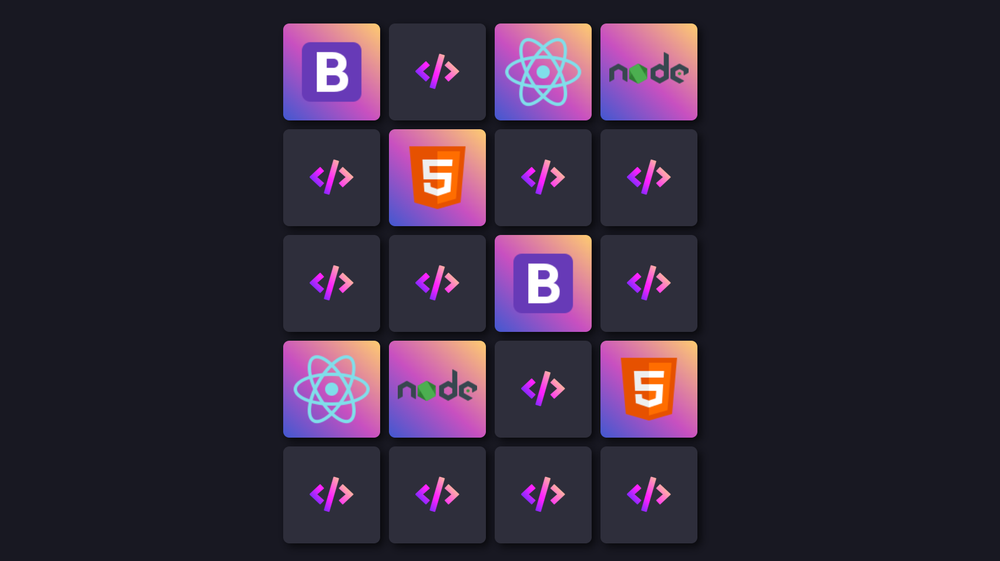
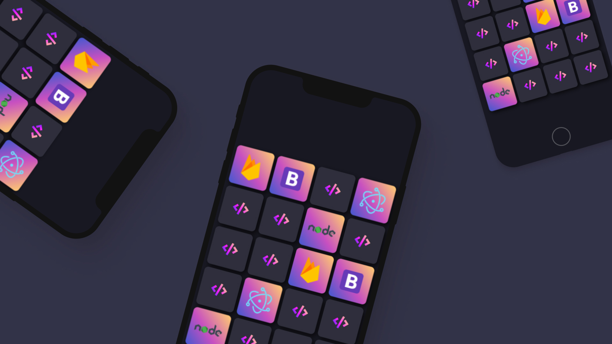

# 
 MATCHING GAME

  

# About:
Matching game is one of the most famous game to improve memory.

The application was developed to improve logic by using JavaScript and how to use BEM Methodology, a representation of a Web Page structure in terms of elements.

## Javascript main challenges:
- Creat functions by applying Clean Code Structure;
- Understand the meaning of "this";
- Callback functions;
- Understand how suffle function is created by Logic;

## CSS main challenges:

- Use preserve-3d;
- Improve grid method;
- Creat class to flip cards;

## Responsive layout:

  

  
## Skills:

